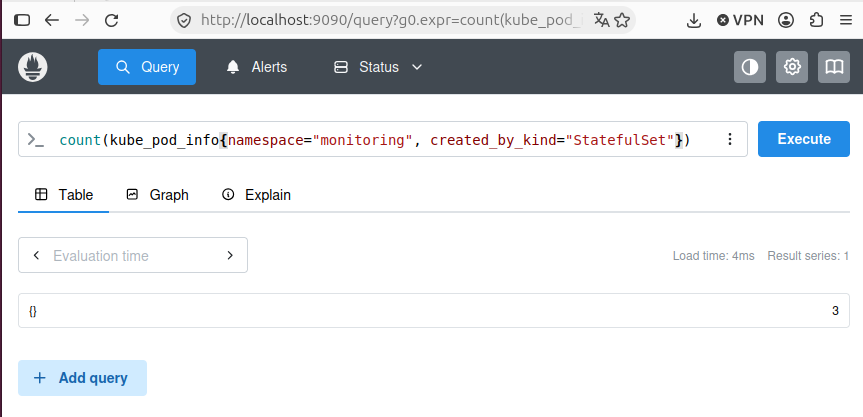

# DevOps with Kubernetes - Exercises submissions

## Local setup

Cluster created with host ports mapped for NodePort/Ingress access:

```bash
k3d cluster create --port 8082:30080@agent:0 -p 8081:80@loadbalancer --agents 2
```

## Chapter 2 - Kubernetes Basics
### First Deploy
- [1.1](https://github.com/Andres02Otero/kubernetes-devops-submissions/tree/1.1)
- [1.2](https://github.com/Andres02Otero/kubernetes-devops-submissions/tree/1.2)
- [1.3](https://github.com/Andres02Otero/kubernetes-devops-submissions/tree/1.3)
- [1.4](https://github.com/Andres02Otero/kubernetes-devops-submissions/tree/1.4)

### Introduction to Networking
- [1.5](https://github.com/Andres02Otero/kubernetes-devops-submissions/tree/1.5)
- [1.6](https://github.com/Andres02Otero/kubernetes-devops-submissions/tree/1.6)
- [1.7](https://github.com/Andres02Otero/kubernetes-devops-submissions/tree/1.7)
- [1.8](https://github.com/Andres02Otero/kubernetes-devops-submissions/tree/1.8)
- [1.9](https://github.com/Andres02Otero/kubernetes-devops-submissions/tree/1.9)

### Introduction to Storage
- [1.10](https://github.com/Andres02Otero/kubernetes-devops-submissions/tree/1.10)
- [1.11](https://github.com/Andres02Otero/kubernetes-devops-submissions/tree/1.11)
- [1.12](https://github.com/Andres02Otero/kubernetes-devops-submissions/tree/1.12)
- [1.13](https://github.com/Andres02Otero/kubernetes-devops-submissions/tree/1.13)

## Chapter 3 - More building blocks
### Networking between pods
- [2.1](https://github.com/Andres02Otero/kubernetes-devops-submissions/tree/2.1)
- [2.2](https://github.com/Andres02Otero/kubernetes-devops-submissions/tree/2.2)

### Organizing a cluster
- [2.3](https://github.com/Andres02Otero/kubernetes-devops-submissions/tree/2.3)
- [2.4](https://github.com/Andres02Otero/kubernetes-devops-submissions/tree/2.4)

### Configuring applications
- [2.5](https://github.com/Andres02Otero/kubernetes-devops-submissions/tree/2.5)
- [2.6](https://github.com/Andres02Otero/kubernetes-devops-submissions/tree/2.6)

### StatefulSets and Jobs
- [2.7](https://github.com/Andres02Otero/kubernetes-devops-submissions/tree/2.7)
- [2.8](https://github.com/Andres02Otero/kubernetes-devops-submissions/tree/2.8)
- [2.9](https://github.com/Andres02Otero/kubernetes-devops-submissions/tree/2.9)

### Monitoring
- [2.10](https://github.com/Andres02Otero/kubernetes-devops-submissions/tree/2.10)

## Chapter 4 - To the cloud
### Introduction to Google Kubernetes Engine
- [3.1](https://github.com/Andres02Otero/kubernetes-devops-submissions/tree/3.1)
- [3.2](https://github.com/Andres02Otero/kubernetes-devops-submissions/tree/3.2)
- [3.3](https://github.com/Andres02Otero/kubernetes-devops-submissions/tree/3.3)
- [3.4](https://github.com/Andres02Otero/kubernetes-devops-submissions/tree/3.4)

### Deployment Pipeline
- [3.5](https://github.com/Andres02Otero/kubernetes-devops-submissions/tree/3.5)
- [3.6](https://github.com/Andres02Otero/kubernetes-devops-submissions/tree/3.6)
- [3.7](https://github.com/Andres02Otero/kubernetes-devops-submissions/tree/3.7)
- [3.8](https://github.com/Andres02Otero/kubernetes-devops-submissions/tree/3.8)

### GKE features
- [3.9](https://github.com/Andres02Otero/kubernetes-devops-submissions/tree/3.9)
- [3.10](https://github.com/Andres02Otero/kubernetes-devops-submissions/tree/3.10)
- [3.11](https://github.com/Andres02Otero/kubernetes-devops-submissions/tree/3.11)
- [3.12](https://github.com/Andres02Otero/kubernetes-devops-submissions/tree/3.12)

## Chapter 5 - GitOps and friends
### Update Strategies and Prometheus
- [4.1](https://github.com/Andres02Otero/kubernetes-devops-submissions/tree/4.1)
- [4.2](https://github.com/Andres02Otero/kubernetes-devops-submissions/tree/4.2)
- [4.3](https://github.com/Andres02Otero/kubernetes-devops-submissions/tree/4.3)
- [4.4](https://github.com/Andres02Otero/kubernetes-devops-submissions/tree/4.4)
- [4.5](https://github.com/Andres02Otero/kubernetes-devops-submissions/tree/4.5)

### Messaging Systems
- [4.6](https://github.com/Andres02Otero/kubernetes-devops-submissions/tree/4.6)

### GitOps
- [4.7](https://github.com/Andres02Otero/kubernetes-devops-submissions/tree/4.7)
- [4.8](https://github.com/Andres02Otero/kubernetes-devops-submissions/tree/4.8)
- [4.9](https://github.com/Andres02Otero/kubernetes-devops-submissions/tree/4.9)
- [4.10](https://github.com/Andres02Otero/kubernetes-devops-submissions/tree/4.10) (configuration repository: [kubernetes-devops-project-config](https://github.com/Andres02Otero/kubernetes-devops-project-config))

## Chapter 6 - Under the hood
### Custom Resource Definitions
- [5.1](https://github.com/Andres02Otero/kubernetes-devops-submissions/tree/5.1)

### Service Mesh
- [5.2](https://github.com/Andres02Otero/kubernetes-devops-submissions/tree/5.2)
- [5.3](https://github.com/Andres02Otero/kubernetes-devops-submissions/tree/5.3)
- [5.4](https://github.com/Andres02Otero/kubernetes-devops-submissions/tree/5.4)

### Beyond Kubernetes
- [5.6](https://github.com/Andres02Otero/kubernetes-devops-submissions/tree/5.6)
- [5.7](https://github.com/Andres02Otero/kubernetes-devops-submissions/tree/5.7)

---

## Exercise 3.9 - DBaaS vs DIY

On GKE we can run Postgres in two ways: keep our own instance as a StatefulSet on top of PersistentVolumeClaims (DIY, what the project uses today), or hand the job to a managed service such as Google Cloud SQL (DBaaS). Both are common in production and both are reasonable for a small project, but they trade off very differently once you look at who does the work and who pays for it.

| Criterion | DIY (StatefulSet + PVC) | DBaaS (Cloud SQL) |
|---|---|---|
| Initial setup work | Manifests already exist (StatefulSet, headless Service, Secret, `volumeClaimTemplate`) and GKE provisions the disk on its own. | Enable the Cloud SQL Admin API, create the instance, then connect the cluster to it (Cloud SQL Auth Proxy or private IP, credentials, IAM). More moving parts. |
| Initial cost | Only a small disk on a cluster we already pay for: cents per month at our size. | A small shared-core instance is billed continuously, even when the app is idle. For a student project that can be a noticeable part of the credits. |
| Ongoing maintenance | We own it: Postgres upgrades, image patches, tuning, monitoring, pod restarts. | Google owns the engine: patching, minor upgrades, disk management, node failures. We keep schema and access control. |
| Backups | None out of the box; we build them (see below). | Automated backups are a setting, on-demand backups are one command. |
| Restore | Manual: find the dump, start a Postgres, restore, repoint the backend. | A first-class operation: pick a backup or timestamp and Cloud SQL builds a new instance. |
| High availability | Single replica. Our own replication and failover would be significant work. | Regional HA is an option: a standby in another zone with automatic failover. |
| Scaling | Manual (resize the disk, add replicas ourselves). Irrelevant at our data volume. | Vertical scaling by changing the instance size (it restarts); read replicas are supported. |
| Security / access | We manage the Secret and the Service; traffic stays inside the cluster. | IAM, TLS, private IP or the Auth Proxy. Less to get wrong, more Google-specific concepts. |
| Portability | Runs on any Kubernetes cluster; only the StorageClass is cluster-specific (we leave it unset so GKE picks its default). | Tied to Google Cloud; moving means exporting data and rewriting the connection layer. |
| Per-branch environments | Almost free: each branch namespace gets its own Postgres pod and small disk, which fits our GitHub Actions + Kustomize flow. | Awkward and costly: one instance per branch is slow and expensive, so we would share one instance with a database per environment. |

### Backups

**DIY.** The plan for exercise 3.10 is a CronJob that runs `pg_dump` against `postgres-svc` and uploads the dump to a Cloud Storage bucket every 24 hours. It is simple and transparent, but restoring is entirely manual. Snapshots of the persistent disk are a coarser safety net, and anything like point-in-time recovery would mean running a tool such as pgBackRest or Barman ourselves, which is realistic for a team and heavy for one person.

**DBaaS.** Backups are part of the product: automated daily backups, on-demand backups, and optional point-in-time recovery with a retention window. Restoring is part of the product too. The catch is that this convenience is what we pay for continuously.

### Pros and cons

**DIY**
- Pros: cheap at our scale, portable, fits the per-branch model, teaches how Postgres behaves on Kubernetes.
- Cons: we own patching, upgrades, monitoring and backups; no HA; restores are manual and easy to get wrong.

**DBaaS (Cloud SQL)**
- Pros: automated backups and easy restores, managed patching, optional HA and point-in-time recovery, smaller operational surface.
- Cons: billed even when idle, one instance per branch is impractical, Google lock-in, hides mechanics we are here to learn.

### Conclusion

For this project (a solo learning exercise with tiny data, minimal traffic, a limited credit budget and a workflow that already spins up a full environment per branch) DIY is the better fit: each branch gets its own Postgres almost for free, we stay portable, and we practice the operational skills the course teaches. Cloud SQL becomes the better choice once the data matters: a production service with real users, a team with no time to operate a database, or a need for HA and point-in-time recovery that we do not want to build. The trade-off is money and lock-in on one side, time and risk on the other.

Cost figures here are approximate and change over time; check the [Google Cloud pricing calculator](https://cloud.google.com/products/calculator) before deciding.

## Exercise 4.3 - Prometheus query

Prometheus runs in the `monitoring` namespace (installed with Helm in exercise 2.10, release `prom`), so the query filters on `monitoring` instead of `prometheus`:

```promql
count(kube_pod_info{namespace="monitoring", created_by_kind="StatefulSet"})
```

Result: `3` (`loki-0`, `loki-chunks-cache-0` and `loki-results-cache-0`).


