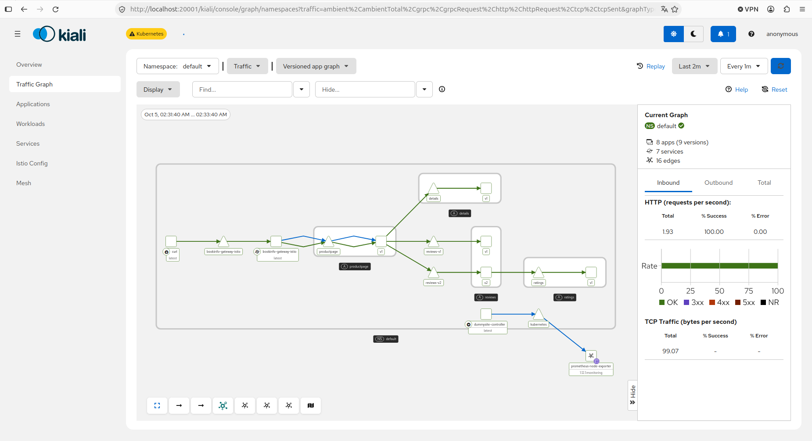

# Istio ambient mode (ejercicio 5.2)

Instalacion de Istio en modo **ambient** en el cluster k3d y recorrido de la guia oficial *Getting started* con la app de ejemplo Bookinfo, hasta antes de *Clean up*.

- **Version:** Istio **1.29.8**. El cluster es k3s **1.31**, que Istio 1.29 soporta oficialmente; Istio 1.30/1.31 piden Kubernetes 1.32 o superior.
- **k3d:** se instala con `values.global.platform=k3d`, porque k3d guarda la configuracion y los binarios de CNI en rutas no estandar ([platform prerequisites](https://istio.io/v1.29/docs/ambient/install/platform-prerequisites/#k3d)). Traefik no se desactiva: el gateway de Bookinfo se deja como `ClusterIP` y se abre con port-forward, asi no compite por los puertos 80/443.
- **Prometheus:** se usa el que ya corre en el cluster (Helm, release `prom`, namespace `monitoring`, ejercicio 2.10) en vez del addon de Istio; recolecta las metricas de ztunnel y del waypoint por sus anotaciones `prometheus.io/*`.
- **Kiali:** `kiali.yaml` es el addon de Istio 1.29.8 con un unico cambio, la URL de ese Prometheus (`external_services.prometheus.url: http://prom-prometheus-server.monitoring:80`).

## Pasos seguidos

```bash
# Istio CLI
curl -L https://istio.io/downloadIstio | ISTIO_VERSION=1.29.8 sh -
export PATH="$PWD/istio-1.29.8/bin:$PATH"

# Istio ambient en k3d + Gateway API
istioctl install --set profile=ambient --set values.global.platform=k3d --skip-confirmation
kubectl get crd gateways.gateway.networking.k8s.io &> /dev/null || \
  kubectl apply --server-side -f https://github.com/kubernetes-sigs/gateway-api/releases/download/v1.4.0/experimental-install.yaml

# Bookinfo (deploy-sample-app)
kubectl apply -f istio-1.29.8/samples/bookinfo/platform/kube/bookinfo.yaml
kubectl apply -f istio-1.29.8/samples/bookinfo/platform/kube/bookinfo-versions.yaml
kubectl apply -f istio-1.29.8/samples/bookinfo/gateway-api/bookinfo-gateway.yaml
kubectl annotate gateway bookinfo-gateway networking.istio.io/service-type=ClusterIP --namespace=default
kubectl port-forward svc/bookinfo-gateway-istio 8098:80

# Secure and visualize: ambient en el namespace default + Kiali con el Prometheus propio
kubectl label namespace default istio.io/dataplane-mode=ambient
kubectl apply -f kiali.yaml
istioctl dashboard kiali
for i in $(seq 1 100); do curl -sSI -o /dev/null http://localhost:8098/productpage; done

# Enforce authorization policies (L4 con ztunnel, waypoint, L7) y Manage traffic (90/10 a reviews)
# segun https://istio.io/v1.29/docs/ambient/getting-started/
```

## Resultado

Grafo de trafico de Bookinfo en Kiali:


